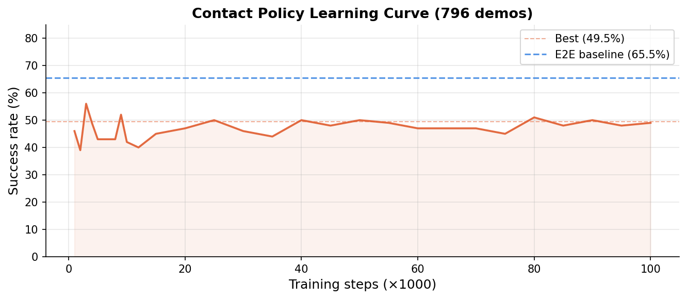
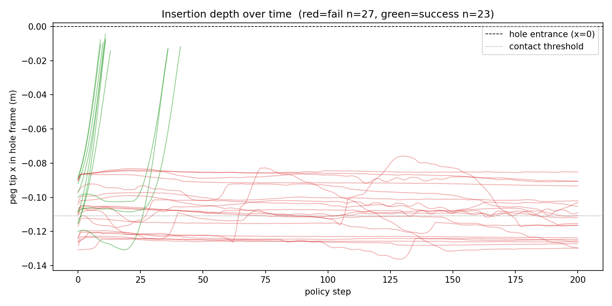
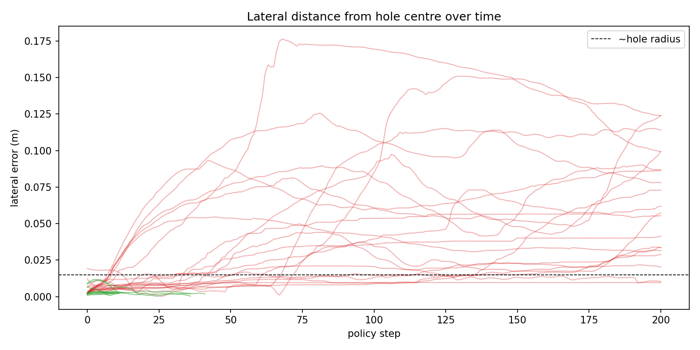
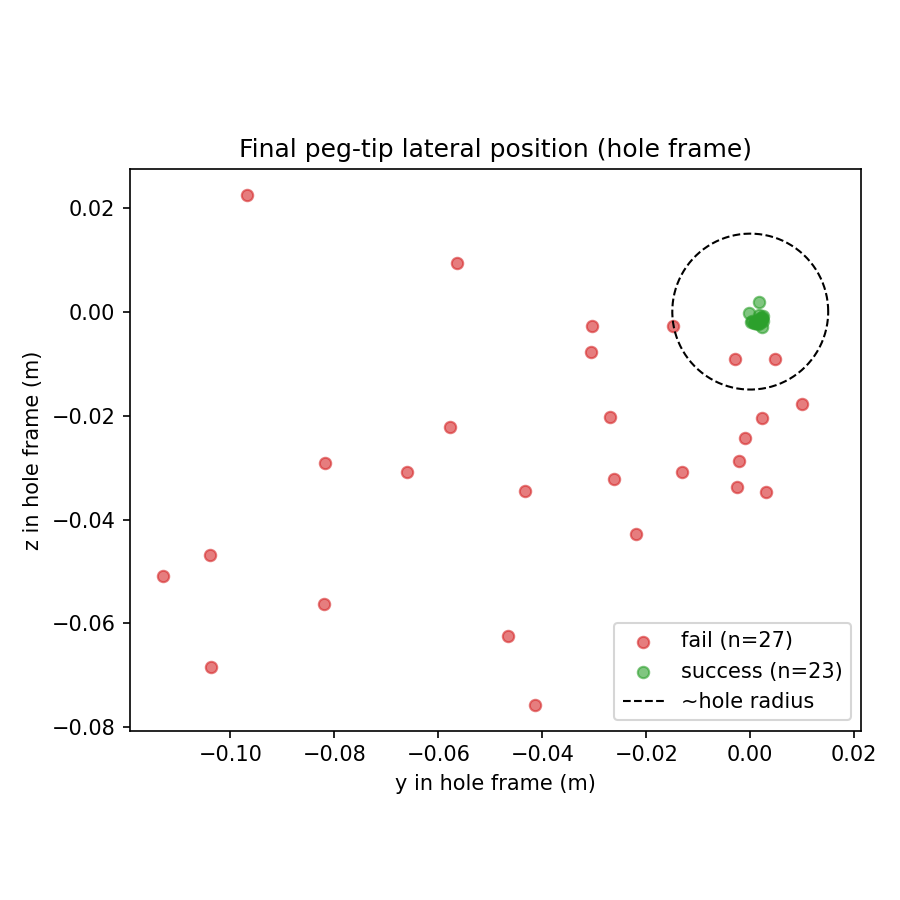
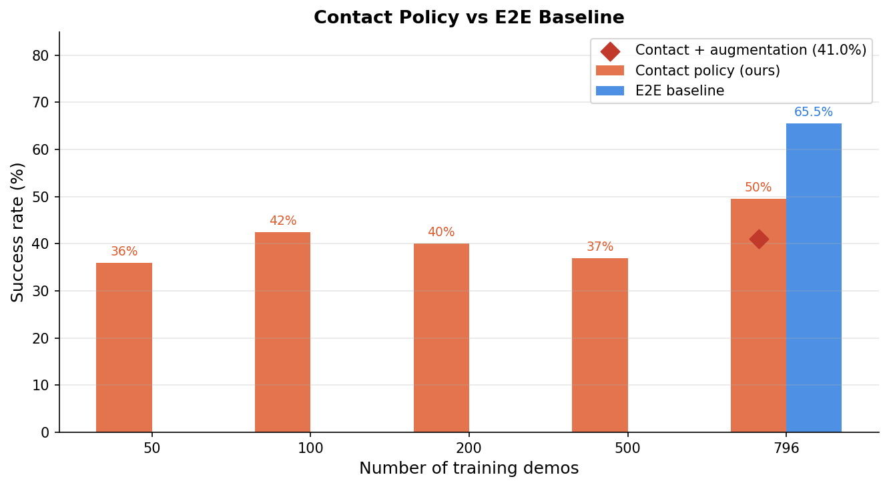

# 我试图让机器人策略可以跨机器人迁移——然后失败了

*2026年5月 · viviwei*

---

> **微信/知乎读者注**：本文记录了一个具身智能方向的个人实验，我是一个没有ML研究背景的软件工程师，第一次尝试从零跑完一个机器人操作实验。结果是负面的——方法没有超过baseline。但失败的原因很有意思，值得写出来。

---

我是一名软件工程师。写了很多年后端，没有做过ML研究。

但我一直在关注具身智能这个方向，看了很多demo之后，我意识到光看是学不到东西的。所以我决定自己动手做一个实验。

任务很经典：**机械臂插销（peg-in-hole）**。假设：把任务分解成几何部分和接触部分，只对接触部分做学习，应该能超过端到端的imitation learning。结果：没超过。下面是完整的过程。

*(成功的rollout — 这是一个成功episode的样子)*

<!-- Bilibili embed: success video -->

---

## 这个想法从哪来的

现在大多数机器人操作策略都是端到端训练的：给机器人看一千条专家演示，训练一个神经网络把观测映射到动作，完事。这套方法可以work，但有一个结构性问题。

**策略学到的是关节角度，不是操作策略本身。**

在Franka Panda上训练的策略，对UR5一无所知，哪怕任务完全一样。因为观测空间里包含了机器人自己的关节配置——这在不同机器人之间是完全不同的。你教会了策略"这个特定机器人怎么动"，而不是"怎么插销"。

这让我觉得有点奇怪。如果是人类学插销，我不会去记忆肘关节的角度——我会学习"当销钉偏左时怎么修正"这类和机械臂无关的规律。

所以想法是：**把任务分解**。

插销任务有两个自然的阶段：

```
阶段一 — 几何：把机械臂移到孔的附近
阶段二 — 接触：在位置不确定的情况下对齐并插入
```

阶段一是纯几何问题，运动规划器（motion planner）可以解析求解，不需要学习，也和机器人型号无关。

阶段二才是难点。接触物理——摩擦、顺从性、偏差——很难建模，需要从数据中学习。

分解方案：用运动规划器替换阶段一，只对阶段二训练策略。关键设计：策略的输入用**TCP到孔的相对位置**，而不是关节角度。这个表示和机器人型号无关——理论上同一个策略可以在任何机械臂上运行。

由此得出两个假设：
1. **数据效率**：策略只需要学习阶段二（~20%的轨迹），所以应该用更少的demo就能达到同样的成功率
2. **跨机器人迁移**：输入和机器人运动学无关，在Panda上训练的策略应该能zero-shot迁移到xArm6

这两个假设听起来都很合理。我在两个方面都错了——但不是以我预期的方式。

---

## 搭实验

实验设置：ManiSkill3里的**PegInsertionSide-v1**，Franka Panda机器人，用[LeRobot](https://github.com/huggingface/lerobot)框架训练[Diffusion Policy](https://diffusion-policy.cs.columbia.edu/)。

收集了996条专家演示（用ManiSkill3内置的运动规划器生成）。接触时刻定义为接触力超过0.1N的第一帧。平均来说，接触onset大概在第29步，整条轨迹大约150步——接触部分占~20%，其余80%是几何接近阶段。

**早期犯的两个错误，值得记录：**

**控制模式选错了。** 我最开始用绝对关节位置控制——策略直接输出目标关节角度。这是一个更难的学习问题，效果很差。切换到delta控制（输出关节角度的变化量，不是绝对值）之后baseline明显好了。对于第一次做ML的SDE来说，"用哪种控制模式"不是一个显而易见的问题。

**没有train/test split。** 我一开始用全部996条demo训练，也在同样的分布上评估。这不是有效的评估——你没办法区分泛化和记忆。后来我意识到这个问题，改成了800条训练、200条held-out测试（最后200条demo，有不同的随机种子）。本文所有数字都使用held-out测试集。

---

## 结果

**E2E baseline**：800条demo，训练200k步，200个held-out episodes评估。**成功率65.5%。**

这是需要超越的目标。

**接触策略sweep**——同样的评估方式，改变训练demo数量：

| Demo数量 | 成功率 |
|---------|-------|
| 50      | 36.0% |
| 100     | 42.5% |
| 200     | 40.0% |
| 500     | 37.0% |
| 796     | 49.5% |

用796条demo训练的接触策略（全量训练集），最好成绩是**49.5%**——比E2E低了16个百分点。数据效率假设已经破功了：接触策略用更多数据依然输给E2E baseline。

更奇怪的是：增加训练步数没有帮助。下图是796条demo接触策略从1k到100k步的learning curve：



成功率在39%–56%之间随机抖动，没有任何上升趋势。策略几乎从一开始就停止改进了。

有什么更根本的问题。

---

## 诊断

*(失败的rollout — 失败episode的样子)*

<!-- Bilibili embed: failure video -->

数字很糟糕，但"糟糕"不告诉你该改什么。我做了一个失败诊断：记录每个episode里销钉头部相对于孔的位置，把成功和失败分开，画轨迹图。

出来三张图：



*成功的episode会稳定地插入。失败的episode根本到不了孔的入口。*



*失败的episode从第一步就偏离了3-4倍孔半径的距离，策略立刻丢失了方向。*



*episode结束时销钉头部的位置。成功的聚集在孔中心附近；失败的散落在各处——平均横向误差54.7mm，孔半径约15mm。*

**失败是二元的。** 没有"差一点"的情况。Episode要么完全成功，要么销钉离孔十万八千里，中间没有任何过渡。

这是**covariate shift（协变量偏移）**，看到图之后我立刻明白了learning curve为什么是平的。

因果链：

训练用的996条demo都是ManiSkill3的scripted运动规划器生成的，它走的是固定的、接近最优的路径。所以每条demo到达接触onset时，几乎是从相同的方向、相同的角度、相同的速度到达的。**训练数据里接触onset状态的分布很窄。**

测试时，环境会随机化初始销钉和孔的位置。哪怕是很小的初始配置变化，也会让运动规划器走一条稍微不同的路径，以不同的角度或偏移量到达接触onset。这些接触onset状态**在训练分布之外**。

策略从没见过这些状态，不知道怎么处理，输出了完全错误的动作。

这不是模型容量问题，不是训练不够的问题。训练loss收敛了，架构是标准的，超参数也合理。**失败完全在数据分布里**——策略在一个窄分布上训练，遇到分布外的状态就悄悄失败了。



E2E策略没有这个问题，因为它学的是完整轨迹——包括接近阶段。它建立了更丰富的任务状态内部表示，对初始条件的小变化泛化能力更强。

---

## 没有成功的修复

Covariate shift有一个经典的解法：[DAgger](https://proceedings.mlr.press/v15/ross11a.html)（数据集聚合）。用当前策略rollout，收集策略出错的状态，让专家在那些状态给出正确动作，加入训练集，循环。DAgger让策略在测试时实际遇到的分布上练习。

DAgger需要修改评估循环，支持交互式专家介入。工程量不小。我先试了一个更简单的离线方案：

**接触onset数据增强。** 对996条demo的每一条，取接触onset帧，给销钉位置加随机扰动（y/z方向±3mm、±7mm、±15mm），让scripted规划器从扰动后的状态完成任务，保留成功的恢复轨迹。

这产生了**4539条轨迹**。用增强数据集重新训练200k步，在同样的held-out测试集上评估。

结果：**成功率41.0%**。比没有增强的策略（49.5%）还差。

为什么增强反而变差了？

Scripted规划器从扰动起点的恢复行为本身也是刻板的。给它一个偏移7mm的起点，它用一套固定的方式修正——不是人类在适应扰动，而是脚本在分支。"增强"的轨迹不是真正多样化的，只是同一个修正模式的偏移版本。

把4539条同质化行为塞进训练集，没有带来处理未见过接触onset状态所需的多样性。上限是scripted规划器本身的行为多样性，这个多样性很低。

---

## 我学到了什么

**技术层面：**

Imitation learning里的covariate shift在实验结果出来之前完全看不见。所有指标都正常——训练loss收敛了，架构标准，超参合理。失败完全藏在数据分布里，唯一找到它的方式是可视化失败episode里销钉去了哪里。

Scripted demo的"接触片段"不是我想象的那样。我以为会有29步丰富多样的接触处理行为——任务里最有趣的物理部分。实际上是29步近最优的直线修正，每次都从几乎相同的起始配置出发。这不够训练一个鲁棒策略。

**研究流程：**

要早点做诊断。我花了时间调超参、看训练曲线，才去写失败可视化。写这个脚本花了一个小时，立刻找到了根本原因。回头看，"失败episode里销钉去了哪"应该是我第一个问的问题。

负面结果有自然的停止标准：当你能解释为什么方法失败了，而且解释指向的是结构性的数据问题（而不是调参问题），就停下来。数据增强是不需要DAgger就能修复covariate shift的最简单方法；连这个都没用，说明问题比离线增强能解决的更深。

**作为局外人：**

"理解这个概念"和"能跑完这个实验"之间的距离比我预期的大得多。我花在调LeRobot配置、搞清楚控制模式、让ManiSkill3评估循环正确运行上的时间，比思考ML问题本身的时间还多。这可能是正常的，但不是我预期的。

最让我意外的不是ML部分，而是实验卫生：test split、seed处理、确保评估和训练用同样的demo分布。这些很无聊，但搞错了就会让所有结果作废。我搞错了一个，不得不重跑了一次训练。

---

## 什么方案真的能解决

**DAgger** 是正规解法。让学到的策略在测试分布上rollout，收集失败的状态，获取专家在那些状态的动作，加入训练。这直接解决了covariate shift问题。工程量更大，但方向对。

**接触段更丰富的任务。** 插销任务的接触段只有~29步，而且全来自narrow的scripted分布。接触动态更丰富的任务——比如我已经开始分析的[PlugCharger-v1](https://maniskill.readthedocs.io/en/latest/tasks/index.html)（插充电头）——即使不增强，也能给策略提供更多样化的接触行为。

**跨机器人迁移**依然是个开放问题。相对坐标的设计——用TCP到孔的相对位置而不是关节角度——原则上是对的。但需要在单机器人版本work之后才能测试。这一步还没到。

---

实验在主要目标上失败了。接触策略没有超过端到端，离线数据增强让结果更差了。但基础设施是现成的，失败模式是清晰的，"scripted demo的接触片段太刻板，不足以训练鲁棒策略"是一个有用的结论。

如果你在做类似的工作：早点跑失败诊断，在第一次训练前就设好test split，然后预期数据分布问题会比模型问题更难解决。

代码和所有实验记录在 [GitHub](https://github.com/viviwei/decomp-learn)。
